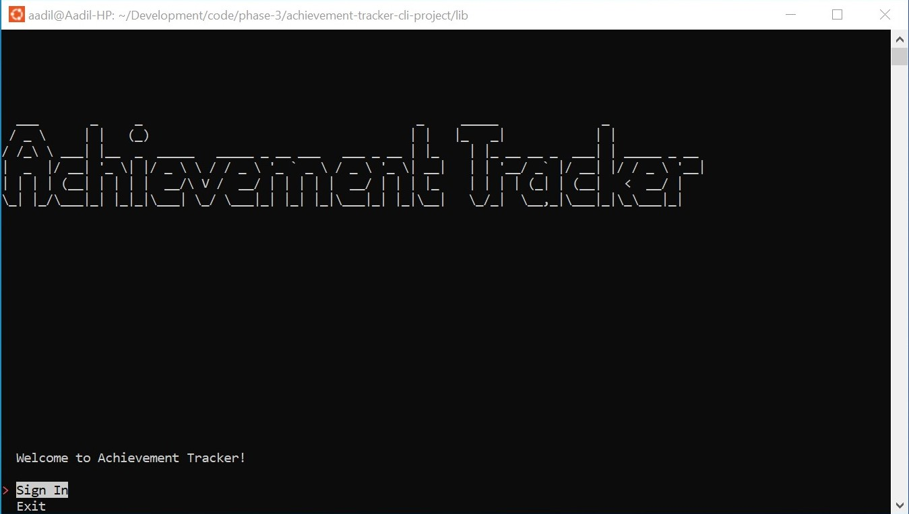
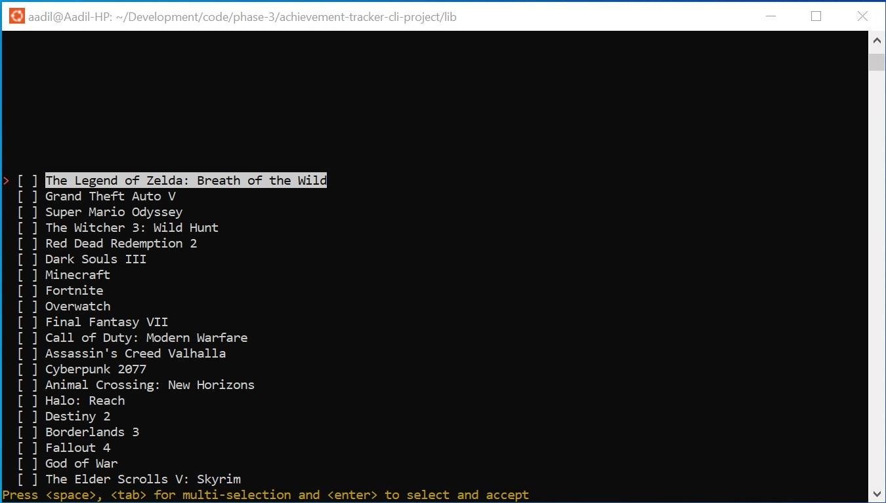
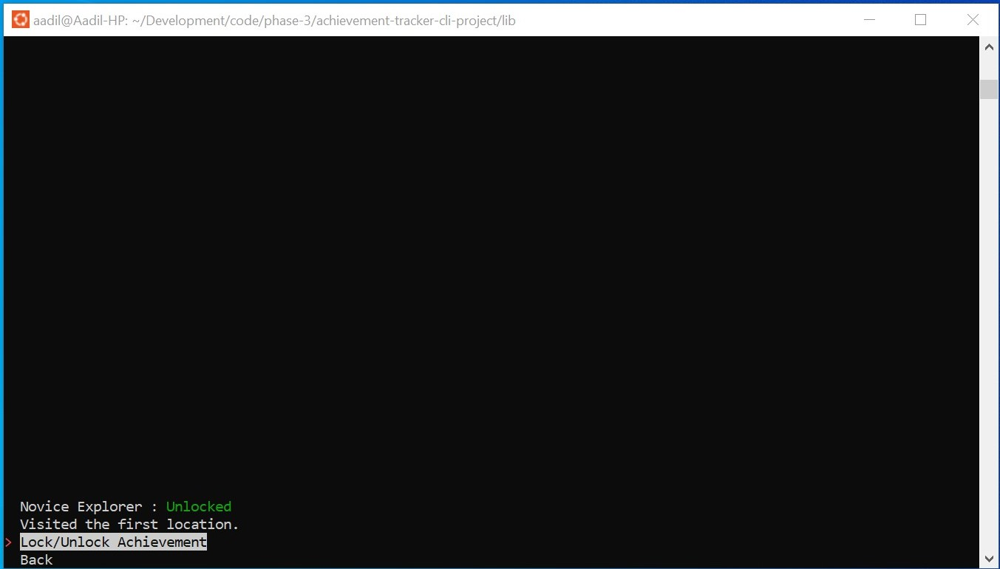

# Achievement Tracker
A command line interface application allowing users to track video game achievements

## Features
* Sign in and create an account to add games to your games list
* Track completion of each video game's achievements. Set an achievement as "Unlocked" once you've completed it. 

## Installation Instructions
Run the command `pipenv install` then `pipenv shell` to start the virtual environment. Move to the \lib directory and run the command `python cli.py` to start the application.

## Files
### cli.py 
* Contains the script for running the cli application. 
* main() : The initial starting menu for the application, with options to sign in and exit.
* sign_in() : Users enter an email and password to sign in and enter the user menu. The email is checked to make sure it is valid. 
* user_menu() : Once signed in, users gain access to a menu with the All Games and My Game List options
* show_game_list() : Shows the personal game list of user
* show_all_games() : Shows a list of games which user can add to their personal game list
* show_game_achievements() : Shows the achievement list for an individual game
* display_achievement_info() : Displays detailed achievement info, including a description and status.
* clear_terminal() and initialize_terminal_menu() : Helper method
### models.py
* Contains the model classes for the users, games, and achievements tables
### header.py 
* Contains the ASCII art for the title header of the start menu

## Screenshots

## Contributing
Pull requests are welcome. For major changes, please open an issue first to discuss what you would like to change.

## License
[MIT](https://choosealicense.com/licenses/mit/)

## Sources
ASCII header art from [https://patorjk.com/software/taag/#p=display&f=ANSI%20Shadow&t=toy%20tracker](https://patorjk.com/software/taag/#p=display&f=ANSI%20Shadow&t=toy%20tracker)

Database seed data generated by ChatGPT
